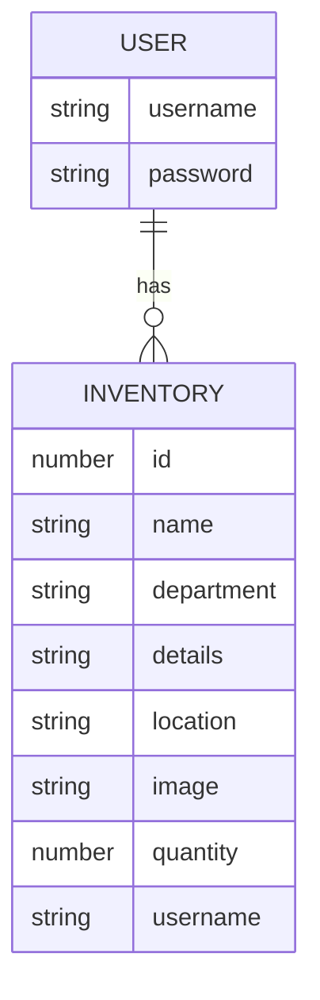

# SupplySmart -  Backend

- **Description**: 
"SupplySmart" Backend API is built using Django and PostgreSQL. The API provides routes for the CRUD operations on inventory items. The API is accessible via HTTP requests to specific routes, and provides JSON responses. 
- **Technologies used**: 
Django
PostgresSQL

### Models

### Backend Route Table
| Route Name |     URL    | HTTP Verb |        Description        |
|------------|------------|-----------|---------------------------|
|   Index    | /inventory/     |    GET    | Display list of items    |
|   Show     | /inventory/:id |    GET    | Shows a specific item    |
|   Create   | /inventory/    |    POST   | Add new item to database |
|   Update   | /inventory/:id |    PUT    | Update a specific item   |
|   Delete   | /inventory/:id |   DELETE  | Delete a specific item   |

### API
[Deployed Backend Link](https://inventory-api-92cp.onrender.com/inventory/)

### User Stories
- As a user, I can see a json response of all the items when I visit the url + /inventory/  page
- As a user, I can see detailed information about a specific item
- As a user, I can create a new item and add to the database
- As a user, I can update any specific item 
- As a user, I can delete any specific item